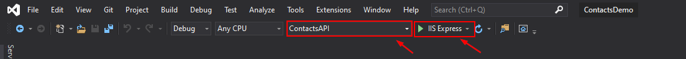
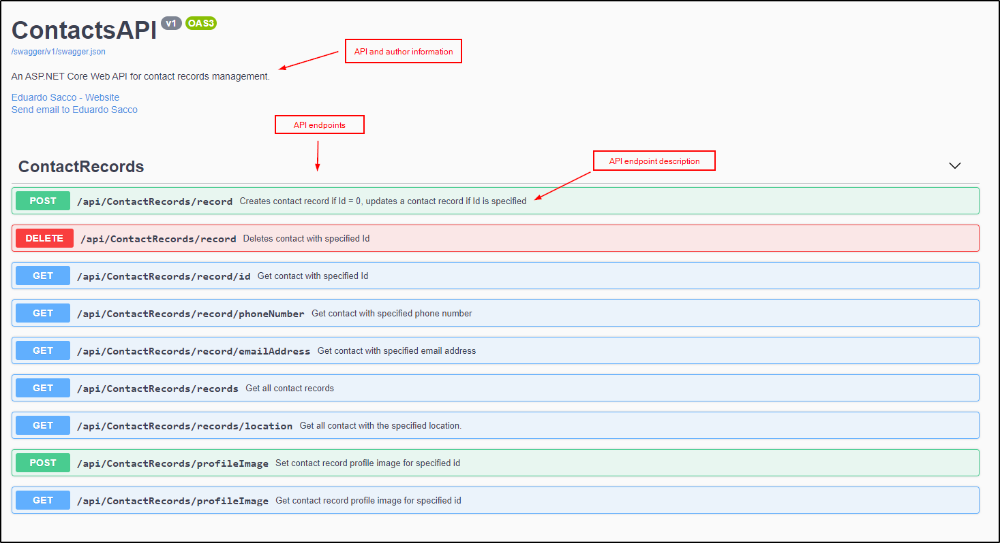
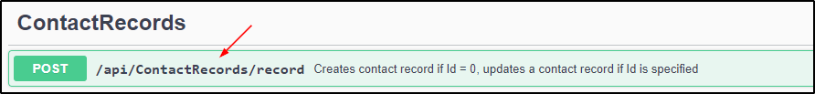
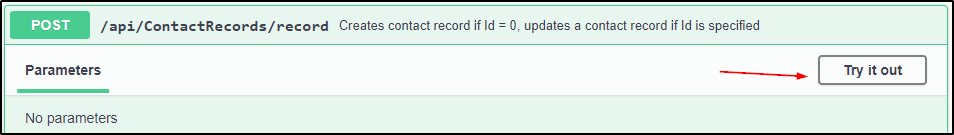
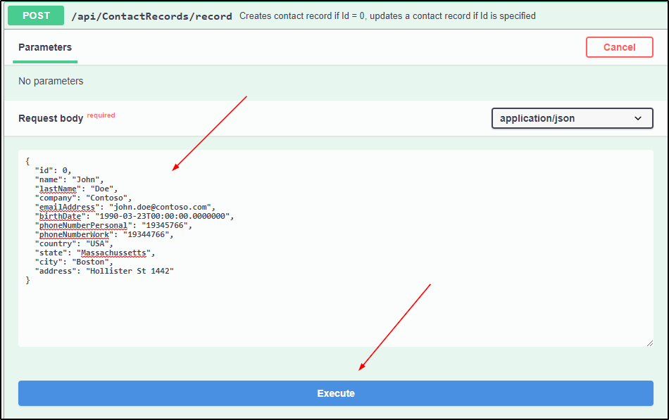
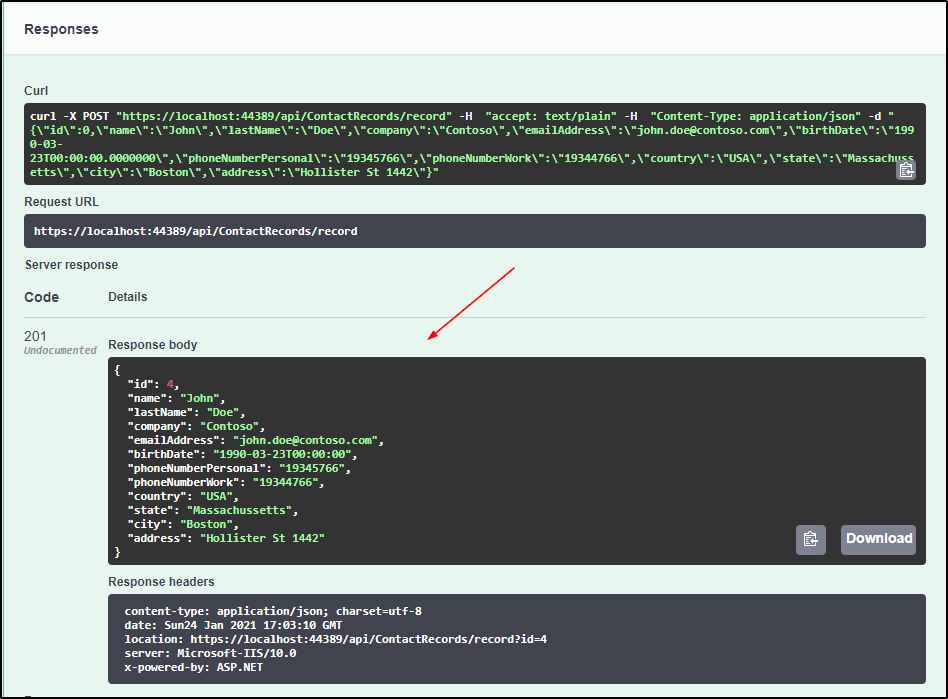

# contacts-api-demo

By **Eduardo Sacco**.
Contact: saccoeduardo@gmail.com.

## Overview
This is a demo for a web API to handle contact records information.
The API exposes endpoints to enable CRUD operations for contact records.

This demo uses an in memory database, which it seeds with mock information for testing purposes.

## How to use?
Easiest way to test the contacts API demo is to use the Swagger UI. For convenience the UI is the launch URL for the demo.

To run the contacts API demo you need to:

1. Open the **ContactsDemo** solution in contacts-api-demo\ContactsDemo folder.
2. Make sure that the **ContactsAPI** project and is selected and run on IIS, or press F5.

3. If prompte choose to trust the ISS Express generated self signed SSL certificate to avoid SSL warnings in the browser.
4. A browser window showing the Swagger UI will be opened.
5. Choose endpoint you want to test. Descriptions and sample data are provided in the Swagger UI for all endpoints.

### Usage example
As an example, the **/record** endpoint usage will be shown.

1. Select the **POST /record** endpoint method to add a new contact record.
Note: each endpoint/method contains a helpful description.

2. Parameters and request body will be filled with example data. Press **Try it out**.

3. Modify the parameters/body for the request. In this case we want to add a new record and we will use the example data. Press **Execute** to send the request.
Note: for this endpoint request with ID=0 creates, if existing id is picked the record with that id will be added/updated.

4. Server response http code, body and headers will be shown

## Design notes
### Persistence
For simplicity demo persists data in an in memory database. Connection string would need to be changed to a real DB in productive scenarios.

The in memory DB will be automatically seeded with made-up mock user data.

If the solution is stopped the in memory DB will be wiped out, hence, there is no persistence between multiple runs.

### Contact records
#### Required fields
Assumed that only the following fields are required:
* Name
* LastName
* EmailAddress
* BirthDate
* Country

Records CAN be added if other fields are missing.

#### Location
Multiple fields are used to represent the contact record location:
* Country
* State
* City
* Address

This enables possibility to get contacts by Country, Country + State, Country + City, and Country + State + City combinations. This functionality is given by the **/records/location** endpoint.

### Profile images
Assumed that the profile pictures would be of small size, a max size limit of 256 KB is allowed. Images are stored in DB.

Images are stored in a separate DB table to avoid adding the image size overhead when operating with the contact record data.

Endpoints are provided to set and get the contact record profile image for contact records by id.

Validations:
* File size checked to be lower than 256KB.
* File signature checked to see if file is actually .png or .jpeg.

### Unit test coverage
For time constraints reasons not all endpoints and scenarios are covered.

## Possible improvements
If time constraints were not in place it would be cool to add:
* Unit test coverage for all endpoints.
* Better error handling in ContactRecords Service and Controller.
* Authentication to use the API.
* Redis cache to ease DB usage.
* Image resize/compression if user wants to upload a big image file.

